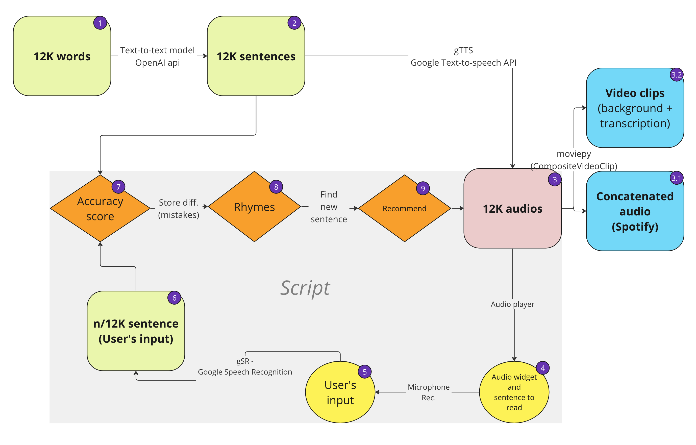
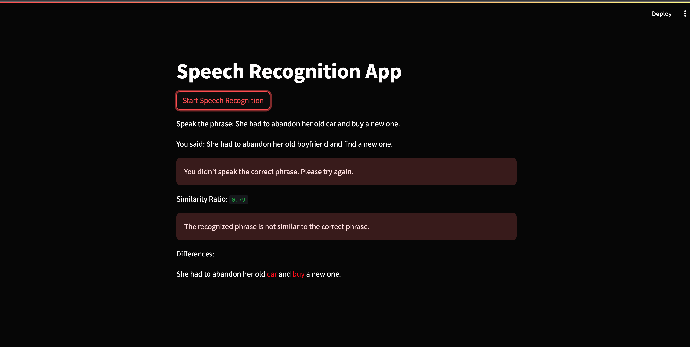

## Language Learning service 
### Speech recognition and recommendation system:
Increasing linguistic vocabulary and pronunciation with the help of AI

---


## Description:
The idea of the project is to let the user listen to the sentences and repeat them.
Afterwards, the user is given an accuracy score based on his input and, based on the mistakes he made (if any), is recommended the other sentence to practise or to move on to the next sentence.

---



## Structure:
* The vocabulary database has been created using OpenAI API and has been divided into 6 levels of difficulty (A1,A2,B1,B2,C1,C2). (In public repository only A1 level dataset shared)
* For each word in the vocabulary, we generated a sentence using OpenAI API corresponding to the difficulty level.
* Then convert the sentences to audio on demand using gTTS Google Text-to-Speech API
* After that, the user could read, listen and repeat the sentence. Make an input via microphone
* Using gSR Google Speech Recognition API, we recognise and store the user's input
* Recognised sentence is compared with the ground truth and the difference (error) is returned.
* System finds rhymes for those misspelled words
* And takes sentence containing that rhyme from our database and converts the sentence to audio
* The cycle continues until the user quits the program or no more rhymes are found.

---
Part of the functional is deployed on a local Streamlit page.


---

For installing the virtual environment you can either use the Makefile and run `make setup` or install it manually with the following commands: 

```Bash
pip install -r requirements.txt
```
